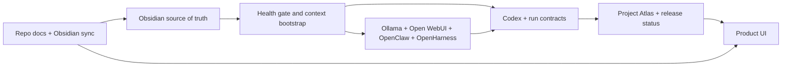

# LOCAL AI OS architecture

## Top-level map

## Layers

### 1. Obsidian source of truth

Obsidian keeps architecture notes, decisions, goals, system incidents, product docs, and acceptance summaries. It remains the human-readable memory of the system.

### 2. Health gate and context bootstrap

Agents start from current machine health, scoped context retrieval, source notes, and explicit safety boundaries. Stale runtime status must not override fresh health-gate evidence.

### 3. Local runtime center

The adopted center is `Ollama + Open WebUI + OpenClaw + OpenHarness + Obsidian`. New product packaging must not introduce a competing runtime center.

### 4. Execution and contracts

Implementation work is expected to end with scoped source changes, verification, run reports, and concise Obsidian updates when architecture changes.

### 5. Visibility and releases

Project Atlas remains the operator cockpit for local runtime status. The public product site shows the release state through `public/release-status.json`, generated by the release pipeline.

## Interactive UI behavior

The product UI renders the same five layers as buttons. Selecting a layer updates a details panel without navigation or extra dependencies. This keeps the first screen useful on static GitHub Pages.

## Hard boundaries

- No duplicate always-on runtime center.
- No unrestricted command runner.
- No secret-bearing exports.
- No raw conversation mirroring in product docs.
- No CPU-rendering workaround as a finished GUI state on this machine.
